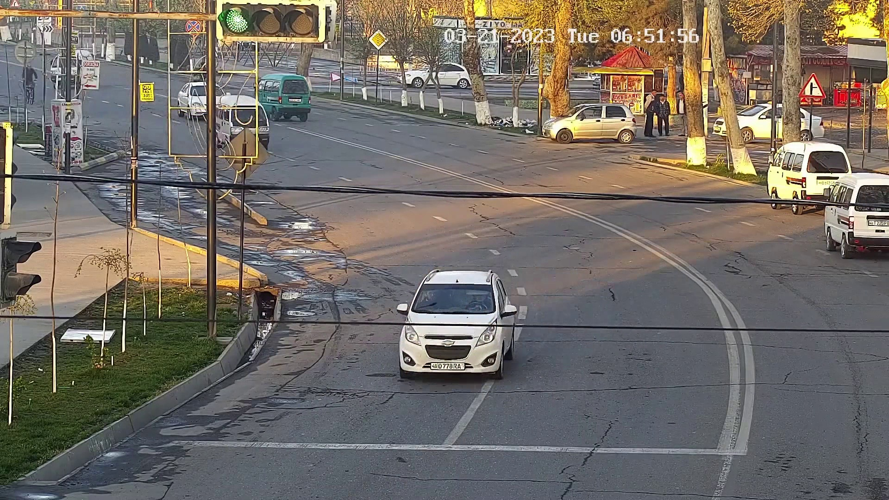
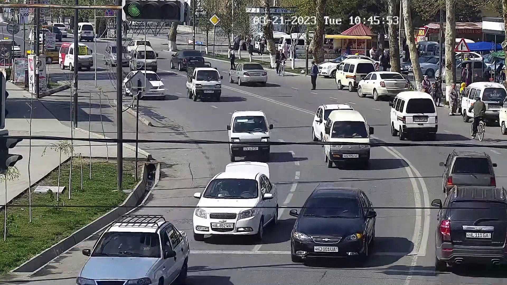
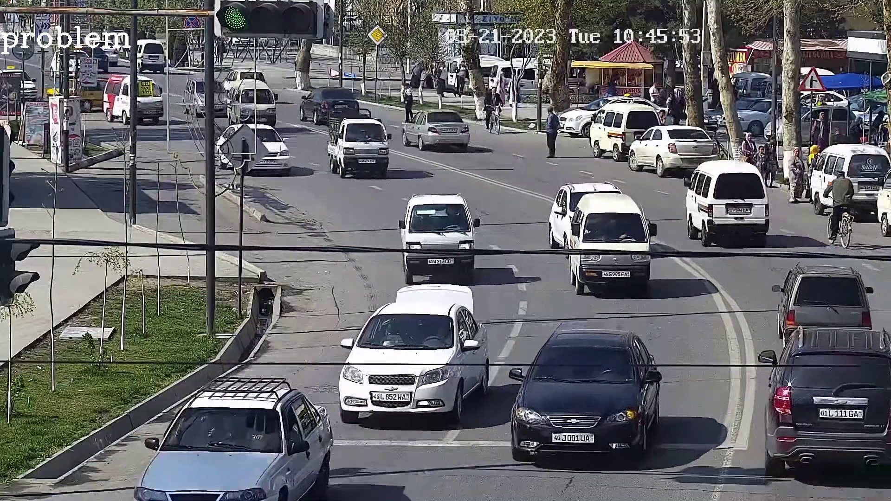

### 128 - 1 - 90 modulida bazi test qilingan videolar uchun link

* Qoida : Mashina ajratilgan yo'l chizig'i(palasa)ni bosishi. 
* 128_1_90 modeli asosida test qilingan.
* Pastdagi linkda joylashgan  - `test qilingan videolar`  - frame shaklda yuklangan.

[Test qilingan videolar uchun manzil](https://drive.google.com/drive/folders/1_ezPx9uKbrbeXvEhQQDUPSsRMx6nELlG)

### Video misollar
 
| video nomi        | original frame                         | testdan keyingi frame                   |
|-------------------|----------------------------------------|-----------------------------------------|
| vid_39_1284-2_745 |  |  |                                                                   
| vid_39_1284-2_750 |  |  |                                                                                                                                 
| vid_39_1284-2_756 |  |  |                                                               
| vid_39_1284-2_762 |  |  |
| vid_39_1284-2_787 |  |  |
| vid_39_1284-2_792 |  |  |
| vid_39_1284-2_799 |  |  |
| vid_39_1284-2_800 |  |  |

### Frame soni jadvali

| Video nomi         | frame soni | model    |         | aslida   |         | aniqligi  |           | aniqligi (nisbat) |            | 
|:-------------------|:-----------|:---------|:--------|:---------|:--------|:----------|:----------|:------------------|:-----------|
|                    |            | good     | problem | good     | problem | good      | problem   | good              | problem    |
| Vid_39_1284-2_740  | 288        | 203      | 85      | 210      | 78      | 7         | -7        | 0.96              | 1.08       |
| Vid_39_1284-2_745  | 189        | 189      | 0       | 147      | 42      | 42        | -42       | 1.28              | 0          |
| Vid_39_1284-2_750  | 399        | 314      | 85      | 313      | 86      | 1         | -1        | 1                 | 1          |
| Vid_39_1284-2_762  | 402        | 354      | 48      | 354      | 48      | 0         | 0         | 1                 | 1          |
| Vid_39_1284-2_787  | 301        | 255      | 46      | 255      | 46      | 0         | 0         | 1                 | 1          |
| Vid_39_1284-2_799  | 117        | 52       | 65      | 50       | 67      | 0         | -2        | 1.04              | 1.03       |
| Vid_39_1284-2_813  | 238        | 216      | 22      | 188      | 50      | 28        | -28       | 1.14              | 1.78       |
| Vid_39_1284-2_816  | 151        | 69       | 82      | 81       | 70      | 12        | -12       | 0.85              | 1.17       |
| Vid_39_1284-2_819  | 424        | 404      | 20      | 404      | 20      | 0         | 0         | 1                 | 0          |
| Vid_39_1284-2_821  | 351        | 302      | 49      | 316      | 35      | 14        | -14       | 0.96              | 1.4        |
| Vid_39_1284-2_2214 | 250        | 144      | 106     | 198      | 52      | 54        | -54       | 0.65              | 2.03       |
| Vid_39_1284-2_2216 | 300        | 189      | 111     | 233      | 67      | 44        | -44       | 0.81              | 1.65       |
| Vid_39_1284-2_2217 | 350        | 144      | 206     | 221      | 129     | 77        | -77       | 0.65              | 1.6        |
| Vid_39_1284-2_2218 | 400        | 295      | 105     | 376      | 24      | 81        | -81       | 0.78              | 4.3        |
| Vid_39_1284-2_756  | 198        | 61       | 137     | 89       | 109     | 28        | -28       | 0.68              | 1.25       |
| Vid_39_1284-2_800  | 296        | 175      | 121     | 212      | 84      | 37        | -37       | 0.82              | 1.44       |
| Vid_39_1284-2_792  | 131        | 0        | 131     | 11       | 120     | 11        | -11       | 0                 | 1.09       |
| Jami/O'rtacha      | 4785/281   | 3366/198 | 1419/83 | 3658/215 | 1127/66 | 436/25.64 | 438/25.76 | 14.62/0.86        | 22.82/1.34 |

